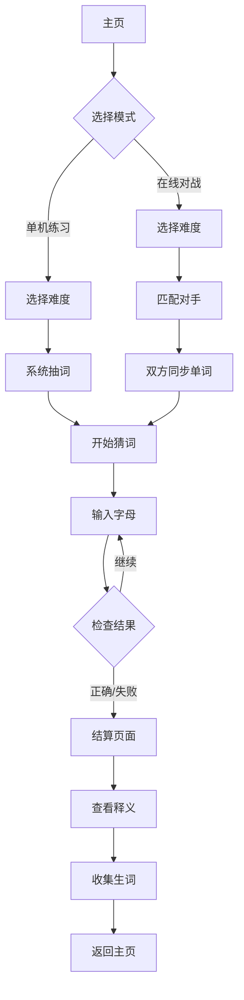

# Wordle Battle 猜词对战游戏 PRD

## 1. 产品概述
一款基于经典Wordle猜词游戏的多人在线对战网页游戏，融合了单词学习与竞技娱乐。玩家可以选择不同难度等级的单词库进行实时1v1对战，每局游戏结束后提供单词释义和学习总结，让玩家在游戏中提升词汇量。

- **核心价值**: 边玩边学，将枯燥的单词记忆转化为紧张刺激的竞技体验
- **目标用户**: 英语学习者、休闲游戏玩家、追求趣味性学习的年轻群体

## 2. 核心功能

### 2.1 用户角色
| 角色 | 注册方式 | 核心权限 |
|------|---------|----------|
| 游客 | 无需注册 | 单机模式练习、查看单词释义 |
| 注册用户 | 邮箱/第三方登录 | 所有功能，包括在线对战、战绩保存、生词本管理 |

### 2.2 功能模块
1. **主页**: 游戏入口、难度选择、快速匹配、单机练习入口
2. **对战页面**: 实时1v1猜词对战界面、倒计时、对手进度展示
3. **结算页面**: 对战结果、单词释义、生词收集、战绩统计
4. **个人中心**: 生词本、战绩记录、学习数据统计

### 2.3 页面详情
| 页面名称 | 模块名称 | 功能描述 |
|---------|---------|----------|
| 主页 | 难度选择器 | 5级难度选择（I青铜/II白银/III黄金/IV钻石/V王者） |
| 主页 | 快速匹配按钮 | 点击后自动匹配对手进入对战 |
| 主页 | 单机练习入口 | 进入单人练习模式 |
| 对战页面 | 猜词格子区 | 显示当前猜测的字母格子，支持键盘输入 |
| 对战页面 | 计时器 | 每局倒计时，增加紧迫感 |
| 对战页面 | 对手进度展示 | 显示对手当前猜词进度和剩余次数 |
| 对战页面 | 字母提示 | 多字母单词时提供部分字母提示 |
| 结算页面 | 胜负结果 | 显示胜负状态和双方用时 |
| 结算页面 | 单词释义卡片 | 展示本局所有涉及单词的释义 |
| 结算页面 | 生词收集按钮 | 将不熟悉单词加入生词本 |
| 个人中心 | 生词本列表 | 按时间排列的生词记录，支持复习 |
| 个人中心 | 战绩统计图表 | 展示胜率、平均用时等数据 |

## 3. 核心流程

### 3.1 单机练习流程
用户进入主页 → 选择难度等级 → 点击单机练习 → 系统随机抽取单词 → 用户开始猜词 → 完成后查看释义 → 可将生词加入生词本 → 结束或继续练习

### 3.2 在线对战流程
用户进入主页 → 选择难度等级 → 点击快速匹配 → 系统匹配对手 → 双方同时收到同一单词 → 开始计时对战 → 用户输入猜测 → 系统反馈字母状态（正确位置/存在但位置错误/不存在）→ 一方猜出或时间结束 → 显示结算页面 → 展示单词释义 → 可收集生词 → 记录战绩 → 返回主页或继续匹配

### 3.3 流程图

## 4. 用户界面设计

### 4.1 设计风格
- **主色调**: 深色背景（深蓝灰）+ 经典Wordle配色方案
  - **正确位置（绿色）**: 字母在正确位置，格子背景变为绿色 (#6aaa64)
  - **存在但位置错误（黄色）**: 字母存在于单词中但位置不对，格子背景变为黄色 (#c9b458)
  - **不存在（灰色）**: 字母不在单词中，格子背景变为灰色 (#787c7e)
- **按钮风格**: 圆角矩形按钮，3D立体效果，悬停时发光
- **字体**: 标题使用粗体sans-serif，正文使用清晰易读的字体，单词格子使用大号等宽字体
- **布局风格**: 卡片式布局，居中对称设计，游戏区域占据中心视觉焦点
- **格子动画**: 翻转动画展示字母状态，增加视觉反馈

### 4.2 页面设计概览
| 页面名称 | 模块名称 | UI元素 |
|---------|---------|--------|
| 主页 | 难度选择器 | 五个等级卡片横向排列，青铜-白银-黄金-钻石-王者，使用渐变色区分等级 |
| 主页 | 快速匹配按钮 | 大号醒目按钮，橙色渐变，点击后显示匹配动画 |
| 对战页面 | 猜词格子区 | 网格布局，每行对应一次猜测，格子翻转动画显示结果 |
| 对战页面 | 计时器 | 数字时钟样式，倒计时变红预警 |
| 对战页面 | 对手进度条 | 显示对手当前猜测次数和进度 |
| 结算页面 | 单词释义卡片 | 卡片式展示，包含单词、释义、例句、词根词缀 |
| 个人中心 | 生词本列表 | 列表卡片，支持点击复习 |

### 4.3 响应式设计
- **桌面端优先**: 主界面在1920x1080分辨率下优化，游戏区域居中
- **移动端适配**: 768px以下改为单列布局，格子区域缩小但保持可操作性
- **触摸优化**: 移动端格子可点击，键盘区域适配触屏

## 5. 单词库设计

### 5.1 分级体系
| 等级 | 名称 | 词汇来源 | 示例词汇量 |
|------|------|----------|-----------|
| I | 青铜 | 初学者词汇 | 常用500词 |
| II | 白银 | 初高中词汇 | 常用2000词 |
| III | 黄金 | 四六级词汇 | CET-4/6核心词 |
| IV | 钛金 | 专八/GRE词汇 | 高级词汇 |
| V | 王者 | 无限制词库 | 各类词汇混合 |

### 5.2 单词数据结构
每条单词记录包含：
- word: 单词本身
- definition: 英文释义
- chinese_meaning: 中文释义
- example_sentence: 例句
- difficulty_level: 难度等级（1-5）
- hints: 可选提示字母（用于长单词）

## 6. 技术约束
- 前端使用React + TypeScript + Tailwind CSS
- 后端使用Node.js + Express + Socket.io（实时通信）
- 响应式设计，支持桌面和移动端
- MVP阶段暂不涉及复杂后端，可先用本地数据模拟