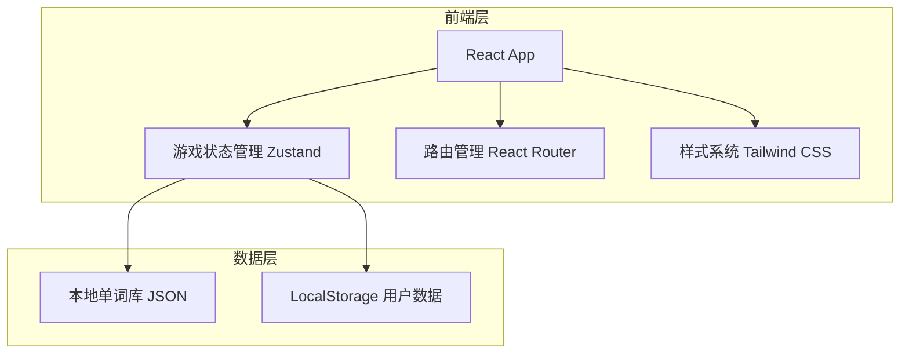
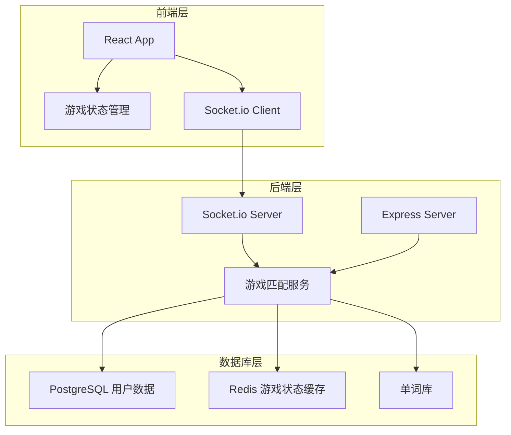

# Wordle Battle 技术架构文档

## 1. 架构设计

### 1.1 MVP阶段架构（前端为主）
由于MVP阶段重点验证核心玩法，架构以前端为主，后端暂时使用本地数据模拟：



### 1.2 完整架构（后续迭代）
后续版本将接入完整后端支持在线对战：



## 2. 技术栈说明

### 2.1 前端技术栈
- **框架**: React@18 + TypeScript
- **构建工具**: Vite
- **样式**: Tailwind CSS@3
- **状态管理**: Zustand（轻量级状态管理）
- **路由**: React Router DOM
- **图标**: Lucide React

### 2.2 后端技术栈（后续版本）
- **运行环境**: Node.js
- **框架**: Express@4
- **实时通信**: Socket.io
- **数据库**: PostgreSQL（用户数据）+ Redis（实时游戏状态）

### 2.3 数据存储
- **单词库**: 本地JSON文件（MVP阶段），后续迁移至数据库
- **用户数据**: LocalStorage（MVP阶段），后续迁移至数据库

## 3. 路由定义

| 路由 | 页面 | 用途 |
|------|------|------|
| `/` | HomePage | 主页，难度选择和游戏入口 |
| `/practice` | PracticePage | 单机练习页面 |
| `/battle` | BattlePage | 对战页面（单机模拟对战或在线对战） |
| `/result` | ResultPage | 结算页面，展示单词释义和战绩 |
| `/profile` | ProfilePage | 个人中心，生词本和战绩统计 |

## 4. 数据模型定义

### 4.1 单词数据模型
```typescript
interface Word {
  id: string;
  word: string;
  definition: string;
  chinese_meaning: string;
  example_sentence: string;
  difficulty_level: 1 | 2 | 3 | 4 | 5; // I青铜到V王者
  hints?: string[]; // 可选字母提示
}
```

### 4.2 游戏状态模型
```typescript
interface GameState {
  currentWord: Word;
  guesses: string[]; // 用户猜测历史
  maxGuesses: number; // 最大猜测次数（默认6次）
  timeLimit: number; // 时间限制（秒）
  elapsedTime: number; // 已用时间
  isGameOver: boolean;
  isWon: boolean;
  opponentProgress?: OpponentProgress; // 对手进度（对战模式）
}

interface OpponentProgress {
  currentGuessIndex: number; // 对手当前猜测次数
  guessedLetters: string[]; // 对手已猜字母
}
```

### 4.3 用户数据模型
```typescript
interface UserData {
  userId: string;
  nickname: string;
  difficultyPreference: number; // 默认难度等级
  wordBook: WordBookEntry[]; // 生词本
  battleHistory: BattleRecord[]; // 对战记录
  statistics: UserStatistics; // 统计数据
}

interface WordBookEntry {
  wordId: string;
  addedAt: Date;
  reviewedCount: number;
  lastReviewedAt?: Date;
}

interface BattleRecord {
  battleId: string;
  date: Date;
  difficultyLevel: number;
  result: 'win' | 'lose';
  timeUsed: number;
  guessesCount: number;
  wordsInvolved: string[];
}

interface UserStatistics {
  totalBattles: number;
  winCount: number;
  winRate: number;
  averageTime: number;
  averageGuesses: number;
  wordsLearnedCount: number;
}
```

## 5. API设计（后续版本）

### 5.1 HTTP API
| 接口 | 方法 | 用途 |
|------|------|------|
| `/api/auth/login` | POST | 用户登录 |
| `/api/auth/register` | POST | 用户注册 |
| `/api/words/:level` | GET | 获取指定难度单词 |
| `/api/user/profile` | GET | 获取用户信息 |
| `/api/user/wordbook` | POST | 添加生词 |
| `/api/user/wordbook` | DELETE | 移除生词 |

### 5.2 WebSocket事件
| 事件 | 方向 | 用途 |
|------|------|------|
| `match:request` | Client→Server | 请求匹配对手 |
| `match:success` | Server→Client | 匹配成功，返回对手信息 |
| `battle:start` | Server→Client | 对战开始，发送单词 |
| `battle:guess` | Client→Server | 发送猜测 |
| `battle:progress` | Server→Client | 对手进度更新 |
| `battle:finish` | Server→Client | 对战结束 |

## 6. 项目结构
```
wordle-battle/
├── src/
│   ├── components/          # 可复用组件
│   │   ├── WordGrid.tsx     # 猜词格子组件
│   │   ├── Keyboard.tsx     # 字母键盘组件
│   │   ├── Timer.tsx        # 计时器组件
│   │   ├── DifficultySelector.tsx # 难度选择组件
│   │   └ WordCard.tsx       # 单词释义卡片
│   ├── pages/               # 页面组件
│   │   ├── HomePage.tsx     # 主页
│   │   ├── PracticePage.tsx # 练习页
│   │   ├── BattlePage.tsx   # 对战页
│   │   ├── ResultPage.tsx   # 结算页
│   │   ├── ProfilePage.tsx  # 个人中心
│   ├── hooks/               # 自定义Hooks
│   │   ├── useGame.ts       # 游戏逻辑Hook
│   │   ├── useTimer.ts      # 计时器Hook
│   │   ├── useWordBook.ts   # 生词本Hook
│   ├── store/               # Zustand状态管理
│   │   ├── gameStore.ts     # 游戏状态
│   │   ├── userStore.ts     # 用户状态
│   ├── data/                # 本地数据
│   │   ├── words.json       # 单词库
│   ├── utils/               # 工具函数
│   │   ├── wordChecker.ts   # 单词检查逻辑
│   │   ├── difficulty.ts    # 难度相关逻辑
│   ├── App.tsx              # 主应用组件
│   ├── main.tsx             # 入口文件
├── package.json
├── tailwind.config.js
├── vite.config.ts
├── tsconfig.json
```

## 7. 开发计划

### 7.1 MVP阶段核心任务
1. 项目初始化（React + TypeScript + Tailwind）
2. 单词库数据准备（5个难度等级，各准备50-100个单词）
3. 核心游戏逻辑（猜词检查、格子状态更新）
4. 基础UI组件（格子、键盘、计时器）
5. 单机练习模式
6. 模拟对战模式（本地AI对手）
7. 结算页面（单词释义展示）
8. 生词本功能（LocalStorage存储）

### 7.2 后续迭代方向
1. 接入真实后端，实现在线匹配对战
2. 用户账号系统
3. 完善学习功能（复习提醒、学习报告）
4. 社交功能（好友、排行榜）
5. 多人房间模式、排位赛模式